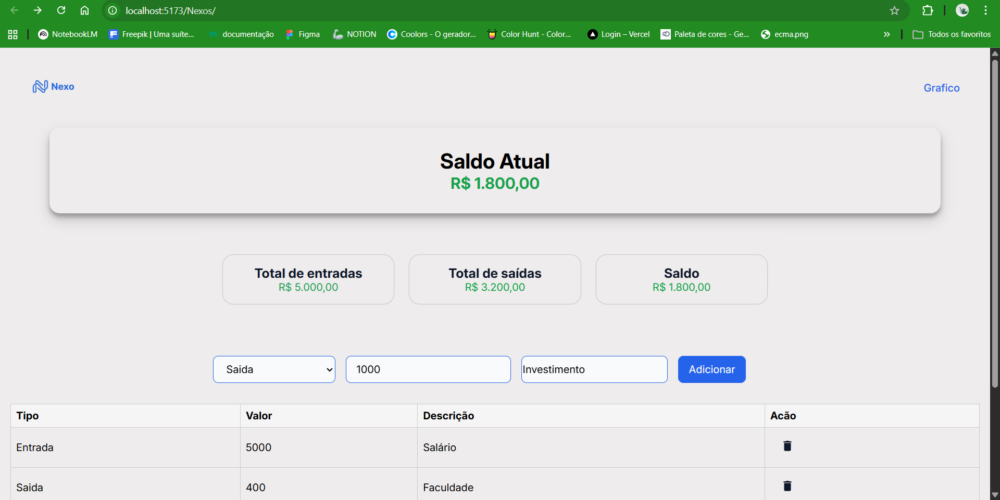

# Nexos - Controle Financeiro

Aplicação web para gerenciamento simples de finanças pessoais.
O usuário pode registrar **entradas e saídas**, visualizar o **saldo atual** e acompanhar um histórico de transações.

O objetivo do projeto é praticar conceitos de **React**, gerenciamento de estado e construção de interfaces interativas.

---
Preview do projeto

## Tecnologias utilizadas

* React
* JavaScript (ES6+)
* Vite
* CSS Modules
* HTML5

---

## Funcionalidades atuais

* Adicionar transações (entrada ou saída)
* Visualizar saldo atual
* Resumo de entradas e saídas
* Listagem das transações em tabela
* Feedback visual ao adicionar transações
* Remoção de transações

---

## Melhorias futuras

Algumas funcionalidades planejadas para as próximas versões:

* Persistência de dados com **LocalStorage**
* Gráfico de gastos e entradas
* Categorias de transações
* Melhorias de responsividade
* Melhor feedback visual para ações do usuário

---

## Como rodar o projeto

Clone o repositório:

git clone https://github.com/seu-usuario/nexos.git

Entre na pasta do projeto:

cd nexos

Instale as dependências:

npm install

Execute o projeto:

npm run dev

Depois abra no navegador:

http://localhost:5173

---

## Objetivo do projeto

Este projeto faz parte do meu processo de aprendizado em **desenvolvimento front-end com React**, focando em:

* manipulação de estado
* componentes reutilizáveis
* lógica de aplicação
* experiência do usuário (UX)

---

## Autor

Desenvolvido por João.
